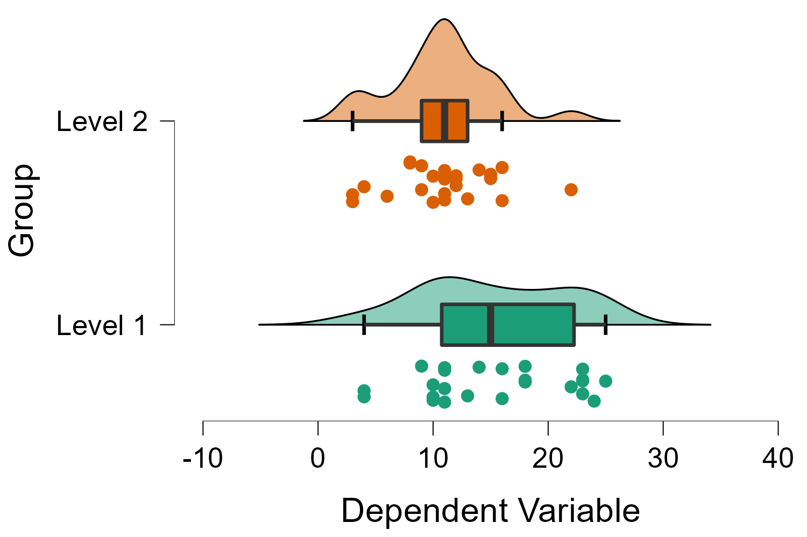

## Mouse-tracking and Intertemporal Choice

During my first research internship at Technische Universität Dresden, I contributed to the data preprocessing and analysis pipeline for a computer mouse-tracking experiment in the context of intertemporal choice. I co-authored a resulting publication in the journal *Behavior Research Methods* ([link](https://doi.org/10.3758/s13428-018-1179-4)), where we (led by Martin Schoemann) investigated the effect of different experimental designs on the behavioral and mouse-tracking results in a common intertemporal choice paradigm. The Matlab code to which I majorly contributed is available on the Open Science Framework ([link](https://osf.io/3w6cr)).

## Gamma Regression and Response Time Analysis

For my bachelor thesis supervised by Dr. Matthias Rudolf at Technische Unversität Dresden, I investigated the applicability of generalized linear models (GLMs) from the gamma family to response time data . The thesis started with an introduction to GLMs, the gamma distribution, and response time analysis, followed by two hands-on examples in R and SPSS on how to apply gamma GLMs to response time data and interpret the results. The thesis is available upon request.

## Eye-tracking and Alternative-non-attendance

For my second research internship at Aarhus University, I designed, programmed, and conducted an experiment about whether consumers attend to all alternatives when deciding between different product options. In collaboration with researchers from the University of Uppsala, I collected both eye-tracking, behavioral, and survey data to infer non-attendance. I presented preliminary results of the study in a short talk at the 38th Meeting of the European Group of Process Tracing Studies in Dresden, Germany. The pre-processing and analysis code is available on the Open Science Framework ([link](https://osf.io/w9ubp/)).

## Eye Movement Classification with a Hidden Markov Model

For my third research internship as part of my master's at the University of Amsterdam, I developed an unsupervised, generative classification algorithm for different events in eye movement data. The algorithm can distinguish four events (fixations, saccades, post-saccadic oscillations, and smooth pursuits), requires very few parameter settings, and outperformed several existing classification algorithms. The algorithm is available as an R package on GitHub ([link](https://github.com/maltelueken/gazeHMM)) and a preprint on the validation can be found on *PsyArXiv* ([link](https://github.com/maltelueken/gazeHMM_validation)).

## Modeling the Spread of COVID-19 in Nordic Countries

As part of the course "Introduction to Computational Science" within my master's program, Eren Asena and I compared the spread of COVID-19 in five nordic countries and the efficacy of their strategies against the spread of the virus. We used publicly available case and travel data and designed a meta-population compartmental model (SEIRS) using stochastic differential equations. The model aimed to predict the spread of COVID-19 while taking the travel between the countries into account. The code for the model and the report on the project is available on GitHub ([link](https://github.com/maltelueken/COVID19_nordic_countries)).

## JASP Prophet Module

The Prophet model created by Facebook is an easy-to-use and flexible forecasting tool for time series data. During my work for the open source software project JASP, I implemented this model into the software as part of the Prophet module (with contributions by Simon Kucharsky). It is an extensive implementation that offers additional data, model parameter, and forecast visualizations. The module is available in JASP 0.15 ([link](https://jasp-stats.org/download/)) and a blog post that introduces the module will be published on the JASP web page soon (written by me and Simon Kucharsky).

## JASP Raincloud Plots

My second contribution to the JASP software were raincloud plots which were created and promoted by Micah Allen and colleagues ([link](https://doi.org/10.12688/wellcomeopenres.15191.2)). Raincloud plots combine a point cloud, a box, and a violin plot, and capture most of the important information about a variable in one figure. They are available in JASP 0.15 ([link](https://jasp-stats.org/download/)) and a blog post that introduces them will be published on the JASP web page soon (written by me).

<!-- # GORIC(A) -->

<!-- Order constraints in linear models allow data analysts to define and test informative hypotheses about parameters in the models. For instance, they can restrict the estimated group means in an ANOVA to be equal or follow a specific order. Multiple models with different constraints can be formulated and compared using information theory based criteria. The Generalized Order Restricted Information Criterion (GORIC) and its approximation (GORICA) enable such comparisons of order constrained models. Together with researchers from Utrecht University, I implemented a GORIC(A) functionality into the JASP ANOVA module. The functionality is still under construction but will be available in JASP soon. -->

## Global Search Heuristics: Differential Evolution

As part of the QHELP online seminar on mathematical/quantitative psychology in March 2021, Marta Melendez and I designed and developed a Shiny app in R to illustrate the mechanics of the Differential Evolution algorithm by Storn and Price (1997). The algorithm was designed to find the global minimum of a given function using populations that evolve in the parameter space. The app is available on the QHELP web page ([link](https://r.qhelp.eu/qhelp/2021/Group5/)) and on GitHub ([link](https://github.com/maltelueken/global_search_heuristics)).

## Parameter Identifiability in Evidence Accumulation Models

For my master thesis supervised by Dr. Dora Matzke and Prof. Andrew Heathcote, I investigated the parameter identifiability of two popular computational models in decision making research: The Diffusion Decision Model (Ratcliff, 1978) and the Linear Ballistic Accumulator (Brown & Heathcote, 2008) which describe how decision-makers accumulate evidence for a choice alternative over time. I designed and conducted three parameter recovery studies to assess the identifiability and sensitivity of the model parameters under different empirical conditions. Currently, I am in the process of converting the thesis into a manuscript for publication. The thesis is available upon request.